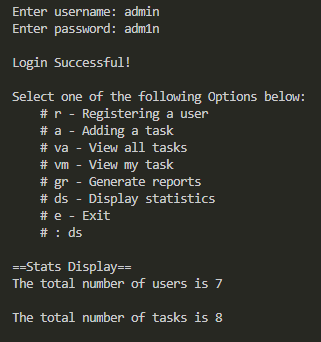

# Task-Manager

## Contents
1. Description
2. Features
3. Installation
4. Usage
5. Package Requirements

## Description
This task manager application is used to manage activities in a small business. It features user accounts with various fearutes depending on user role. Each of these features are coded into separate functions. Usernames and task details are stored in simple text files which is accessed by the program and stored in a temporary dictionary.

## Features
This app allows users to:
1. View tasks
2. Assign tasks
3. Manage deadlines
4. Communicate tasks with other users
5. Edit tasks
6. Generate task and user reports

## Installation
As this is a command line application, there are no complex installation processes. Users can simply download the 'task-manager_modular.py'and run its functions in a python enabled machine.

## Usage
Only the admin is allowed to add and remove users. The default admin username is 'admin', the default admin password is 'adm1n' (feel free to customize this). The admin also registers new users and tasks can be assigned from any account. The admin is also able to generate stats and reports about tasks and users.

Once any user logs in successfully, the features available to the user will be displayed. Above is a working of the display stats function available to the admin. Additional txt files are made available for the admin.

## Package Requirements
* Python 3